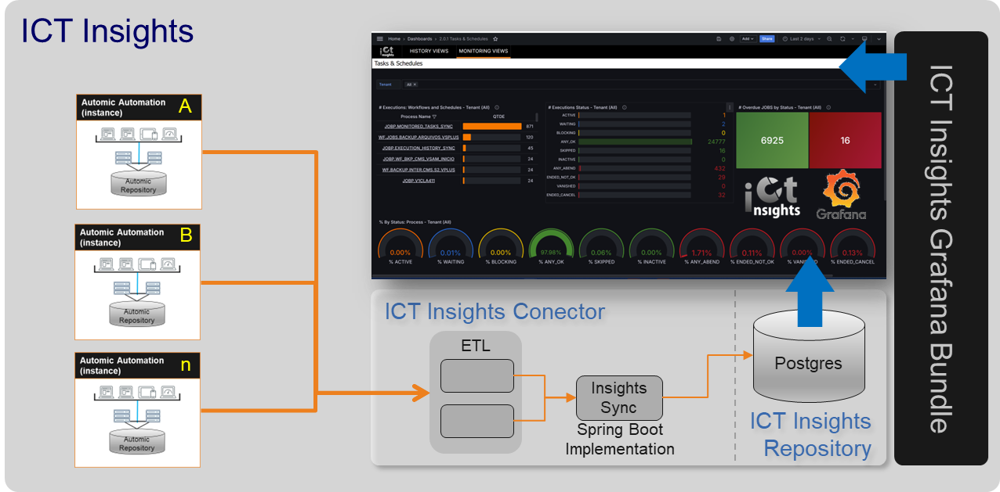

# ICT Insights
ICT Insights is a comprehensive solution designed to facilitate the monitoring and collection
of insights from Broadcom Automic® Automation, among other solutions. It enables users to
monitor both historical and real-time data, providing the ability to visualize key metrics
and performance indicators. This helps optimize and maintain Automic Automation environments
effectively, ensuring efficient operations and proactive issue resolution.

 
  ICT Insights overview

## Getting Started
The entire setup and installation process can be divided into three steps:

1. Configuration of the PostgreSQL database (described in [01_Database/])
2. Importing Automic objects for the current Automic installation (described in [02_Automic/])
3. Installation and configuration of Grafana (described in [03_Grafana/]).

[01_Database/]: 01_Database/
[02_Automic/]: 02_Automic/
[03_Grafana/]: 03_Grafana/

## Requirements
There are three recommended options to run the ICT-Insights Architecture, tailored to different needs and requirements:

### Option 1: Single Server
This option combines all components into one server.

| **Components**                                                                         | **Platforms**             | **Recommended Hardware**                  | **Operating System / Application**                                                      | **JRE Version**  |
|:--------------------------------------------------------------------------------------:|:-------------------------:|:-----------------------------------------:|:---------------------------------------------------------------------------------------:|:----------------:|
| ICT Insights Connector + ICT Insights Repository + Bundle Grafana + Grafana Repository | Windowx x64 / Linux x64   | 32GB MEM, 16 x vCPUs, 2.4GHz, 300 GB disk | Database: Open Source PostgreSQL 14+  Operating system: 64 bit - Windows/Linux       | Open JDK  Java 17 |

### Option 2: Two Servers
This option separates the components into two servers.

#### Server A: ICT Insights Connector + Bundle Grafana + Grafana Repository
| **Platforms**         | **Recommended Hardware**                 | **Operating System / Application**                                                             | **JRE Version**   |
|:---------------------:|:----------------------------------------:|:----------------------------------------------------------------------------------------------:|:-----------------:|
| Linux/Windows         | 16GB MEM, 8 x vCPUs, 2.4GHz, 100 GB disk | Database: Open Source PostgreSQL 14+  Operating system: 64 bit - Windows/Linux              | Open JDK  Java 17 |

#### Server B: ICT Insights Repository
| **Platforms**         | **Recommended Hardware**                 | **Operating System / Application**                                                             | **JRE Version**   |
|:---------------------:|:----------------------------------------:|:----------------------------------------------------------------------------------------------:|:-----------------:|
| Linux/Windows         | 16GB MEM, 8 x vCPUs, 2.4GHz, 100 GB disk | Database: Open Source PostgreSQL 14+  Operating system: 64 bit - Windows/Linux              | Open JDK  Java 17 |

### Option 3: Three Servers
This option separates the components into three servers.

#### Server A: ICT Insights Connector + Bundle Grafana
| **Platforms**         | **Recommended Hardware**                 | **Operating System / Application**                                                                                               | **JRE Version**   |
|:---------------------:|:----------------------------------------:|:--------------------------------------------------------------------------------------------------------------------------------:|:-----------------:|
| Linux/Windows         | 8GB MEM, 4 x vCPUs, 2.4GHz, 100 GB disk  | Operating system: 64 bit - Windows/Linux                                                                                         | Open JDK  Java 17 |

#### Server B: ICT Insights Repository
| **Platforms**         | **Recommended Hardware**                 | **Operating System / Application**                                                                                               | **JRE Version**   |
|:---------------------:|:----------------------------------------:|:--------------------------------------------------------------------------------------------------------------------------------:|:-----------------:|
| Linux/Windows         | 8GB MEM, 4 x vCPUs, 2.4GHz, 100 GB disk  | Database: Open Source PostgreSQL 14+  Operating system: 64 bit - Windows/Linux                                                | Open JDK  Java 17 |

#### Server C: Grafana Repository
| **Platforms**         | **Recommended Hardware**                 | **Operating System / Application**                                                                                               | **JRE Version**   |
|:---------------------:|:----------------------------------------:|:--------------------------------------------------------------------------------------------------------------------------------:|:-----------------:|
| Linux/Windows         | 8GB MEM, 4 x vCPUs, 2.4GHz, 100 GB disk  | Database: Open Source PostgreSQL 14+  Operating system: 64 bit - Windows/Linux                                                | Open JDK  Java 17 |

### Communication Ports
The network/firewall configurations of servers with installed ICT Automation Insights components must observe the
direction of traffic and access to ports as described in the following table:

| **Source** | **Destination** |  **Ports (default)**  |
|:----------:|:---------------:|:---------------------:|
|   Grafana  |     Database    | Postgre SQL 14+: 5432 |
|   Grafana  |    Dashboard    |          3000         |
